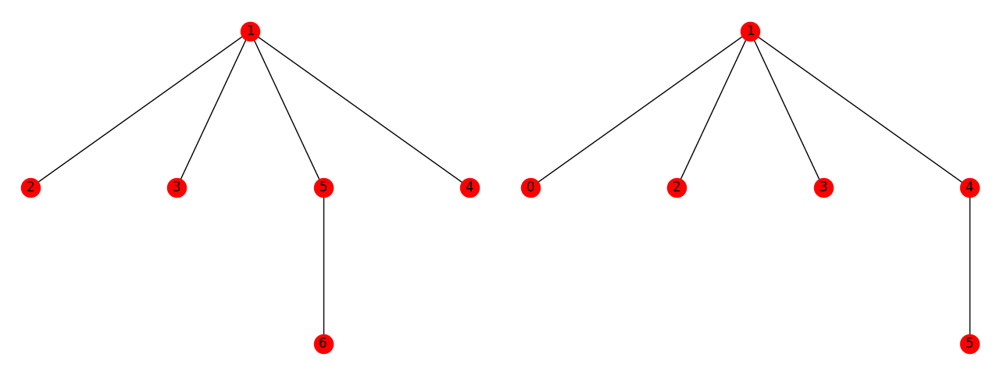

# Fast CBC LMD

Make it fast, please!

## To Run:

Set up a python 3 virtual environment, and then run the command:

## Efficient LMD GHOST (Compressed Block Trees):

CBC needs to check the validity of incomming messages. One requirement for validity is that all messages from other validators are the result of running LMD GHOST over the latest messeges as supplied by the justification in of an incomming message. This means the viability of CBC is highly dependent on how expensive LMD is to run for this purpose, we developed an efficient LMD implementation.

Our implementation makes use of a compressed block-tree. Beacuse LMD GHOST only really cares about the nodes where a decision is made (a node as 2 children) we only need to store these nodes as well as all the nodes that have weight. Here is a comparison between naive LMD GHOST and the compressed version:

To see how it works in depth look at [these slides](IC3%20Bootcamp%20Slides.pdf).

~~~~
pip install -r requirements.txt
pytest test_all.py
~~~~
